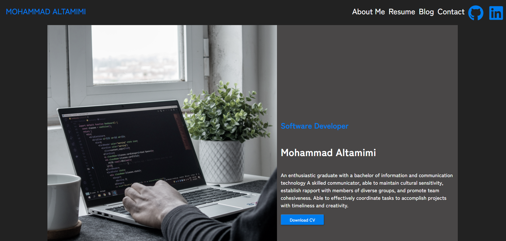

### Live Site

[]: https://mtamimportfolio.netlify.app/	"Live Website"

### Repo Link

[]: https://github.com/maltamimi96/Portfolio	"Repository Link"

## Purpose:

To Provide a personal website that enables me to showcase my skills and experience as well as being a Tool to get to know more about .

## Functionality/Features : 

### 

1.  **Simple design approach ,with minimal colours and animations .**
2. **Easy Navigation Through the Nav section on all pages**
3. **Accessibility for Screen Readers**
4. **SRI for Scripts Security**
5. **Card Component used throughout the site to give a summarized look at blogs and projects in a user friendly manner.**
6. **Responsive design approach was taken to cater for all different devices,including mobile .**
7. **Uses Flexbox to align all items in dynamic manner instead of hard coding everything.**

### 

## Site-map 

## Screenshots:

### **Desktop View**

## **Mobile View--Responsive Design**

## Target Audience:

Target Audience Are Fellow Developers,Employers and Teachers.

## Tech Stack:

### The tech stack  used  is :

**HTML**

**Css**

**JavaScript**

**Sass-scss**

